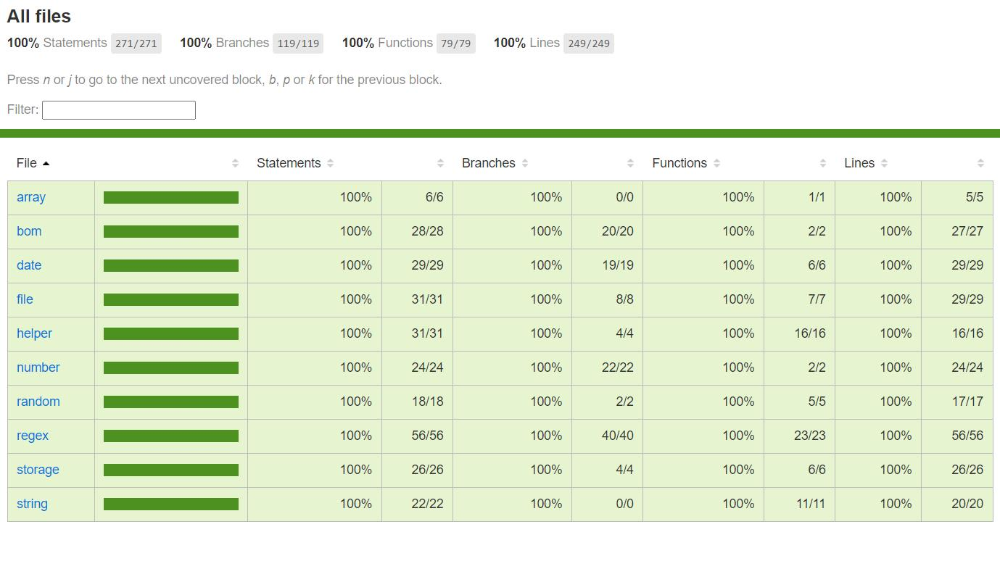

# 什么是 subayai-utils？

[subayai-utils](https://github.com/husky-dot/subayai-utils)，是一个短小而精悍的现代 JavaScript 使用工具库

## 动机

我们在开发业务中总是不得不使用一些方法来提高我们的效率，随着生态越来越完善，高效的工具层出不穷。我们很难记住每一个工具的存在从而降低我们的开发效率。

另外随着 ESM 规范被越来越多的现代浏览器所支持，我们迫切希望拥有一个轻量级，适合现代浏览器，能够像查字典一样根据具体的业务调用函数或工具。

### 通俗易懂的文档

- 基于最新 VitePress 构建，更快，更便捷
- 更快的热更新

### 特点

- 使用 Rollup 打包
- 开启服务端压缩，在 200k 以内

typescript 开发而成，完整的测试用例，测试覆盖率 100%,请放心使用

## 它是所谓高级前端者的又一个轮子吗？

它或许有一些 Fn 涉及了底层的方法，它或许是整理了一些常用的工具，但它也应该是高级开发者不屑重写的 Code
